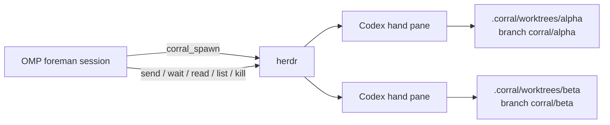

# corral

`corral` is an [Oh My Pi](https://github.com/can1357/oh-my-pi) extension that turns an OMP session into a foreman for visible [OpenAI Codex CLI](https://github.com/openai/codex) hands. Every hand runs as a live Codex TUI in a [herdr](https://herdr.dev) pane and works in its own Git worktree.



## Install

From a clone of this repository:

```sh
./install.sh              # ~/.omp/agent/extensions/corral.ts
./install.sh --project    # ./.omp/extensions/corral.ts
```

The installer creates a symlink, so edits to this checkout are immediately available after restarting OMP (or reloading extensions when supported).

## Requirements

- OMP with extension support
- `HERDR_ENV=1` (run OMP inside a herdr pane)
- `herdr` in `PATH`
- `codex` in `PATH`, authenticated for interactive use
- `git` in `PATH`, with the current directory inside a Git repository
- Codex's herdr integration installed (`herdr integration install codex`)

## Usage

The foreman can call these LLM tools:

- `corral_spawn({ name?, task, base_branch? })` creates `<repo>/.corral/worktrees/<name>` on `corral/<name>`, opens a labeled herdr workspace/pane, launches bare `codex`, waits for its idle handshake, then sends the task.
- `corral_send({ name, message })` waits for the hand to be idle or done and sends another instruction.
- `corral_wait({ name?, timeout_s? })` waits for one hand or all hands to become idle/done.
- `corral_read({ name, lines? })` reads recent pane output (with a visible-pane fallback for terminals where herdr has no recent-unwrapped buffer).
- `corral_list({})` returns each hand's pane, branch, worktree, and herdr status.
- `corral_kill({ name, remove_worktree? })` closes the pane; optionally removes the worktree while preserving its branch.

A `/corral` slash command shows a compact roster notification.

Example prompt to OMP:

> Spawn a hand named api to implement the endpoint described in issue #42. Keep the work on its corral branch, then wait and read its result.

Hands remain visible in herdr so a human can watch Codex work live. State snapshots are persisted in the OMP session as `corral-state` entries and restored on a later session start; panes that no longer exist are dropped.

## Development

```sh
bun install
bun x tsc --noEmit
bun run scripts/smoke.ts
```

The smoke test creates a scratch Git repository and worktree, splits a non-focused herdr pane, runs a marker command, waits for output, reads it, and cleans up only the pane/worktree it created.

## License

MIT
