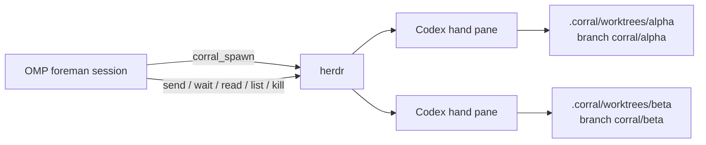

# corral

`corral` is an [Oh My Pi](https://github.com/can1357/oh-my-pi) extension that turns an OMP session into a foreman for visible [OpenAI Codex CLI](https://github.com/openai/codex) hands. Every hand runs as a live Codex TUI in a [herdr](https://herdr.dev) pane and works in its own Git worktree.



## Install

From a clone of this repository:

```sh
./install.sh              # ~/.omp/agent/extensions/corral.ts
./install.sh --project    # ./.omp/extensions/corral.ts
```

The installer creates a symlink, so edits to this checkout are immediately available after restarting OMP (or reloading extensions when supported).

## Skill

This repository includes an Oh My Pi agent skill that automatically teaches OMP the corral foreman protocol.

Do not use `workflowz` or `vibe` modes to drive corral:
- `workflowz` steers OMP to the built-in `task` tool (which spawns standard OMP subagents rather than Codex hands).
- `vibe` mode strips custom extension tools (like the `corral_*` tools) from OMP's toolbelt.

Instead, run OMP in its normal mode. When the skill is installed, the foreman protocol will guide OMP to coordinate Codex hands correctly.

## Requirements

- OMP with extension support
- `HERDR_ENV=1` (run OMP inside a herdr pane)
- `herdr` in `PATH`, with `pane process-info` and Codex session metadata support (verified with Herdr 0.7.4)
- `codex` in `PATH`, authenticated for interactive use
- `git` in `PATH`, with the current directory inside a Git repository
- Codex's herdr integration installed (`herdr integration install codex`)

## Usage

The foreman can call these LLM tools:

- `corral_spawn({ name?, task?, base_branch?, model?, bootstrap? })` creates `<repo>/.corral/worktrees/<name>` on `corral/<name>` and opens a labeled herdr workspace/pane. It waits for a new Codex session, a live Codex foreground process, and stable idle status before dispatching an optional task. Omitting `task` creates a warm, ready hand. `model` is passed to Codex at launch. `bootstrap` can check Codex auth, Git/GitHub auth, and required executables before launch.
- `corral_send({ name, message, recovery? })` waits for tracked work to finish or become blocked, then sends another instruction. Unconfirmed delivery requires explicit `recovery: "retry"`; an exited Codex process requires `recovery: "restart"`. Corral never automatically replays uncertain work and never sends agent instructions to the fallback shell.
- `corral_wait({ name?, timeout_s? })` waits for tracked dispatches. Completion is tied to a persisted dispatch id and requires an observed `working` or `blocked` transition. An untouched warm hand reports ready with `started:false/completed:false`; persistent idle after a send reports `start-unknown` rather than success.
- `corral_read({ name, lines? })` reads recent pane output (with a visible-pane fallback for terminals where herdr has no recent-unwrapped buffer).
- `corral_list({})` returns each hand's pane, branch, worktree, and herdr status.
- `corral_kill({ name, remove_worktree? })` closes the pane; optionally removes the worktree while preserving its branch.

A `/corral` slash command shows a compact roster notification.

Example prompt to OMP:

> Spawn a hand named api to implement the endpoint described in issue #42. Keep the work on its corral branch, then wait and read its result.

Hands remain visible in herdr so a human can watch Codex work live. State snapshots are persisted in the OMP session as `corral-state` entries and restored on a later session start; panes that no longer exist are dropped.

Bootstrap options are read-only and are not submitted as Codex tasks:

```json
{
  "name": "api",
  "model": "gpt-5.6-luna",
  "bootstrap": {
    "codex_auth": true,
    "git_auth": "remote",
    "tools": ["gh", "rg"]
  }
}
```

`git_auth: "remote"` performs a non-interactive `git ls-remote origin HEAD`; `git_auth: "github"` uses `gh auth status`. Tool checks verify presence in `PATH` without executing arbitrary commands.

## Development

```sh
bun install
bun x tsc --noEmit
bun run scripts/smoke.ts
```

The smoke test creates a scratch Git repository and worktree, splits a non-focused herdr pane, runs a marker command, waits for output, reads it, and cleans up only the pane/worktree it created.

## License

MIT
